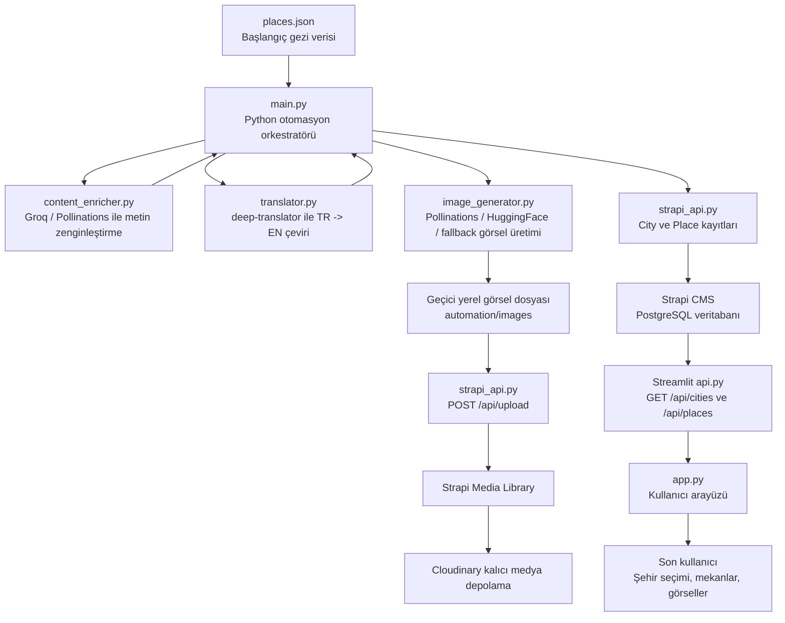

# Final Sınavı Proje Raporu

## Kapak Sayfası

**Proje Adı:** Dünyayi Gezayisun AI Rehberuylan  
**Proje Türü:** YZ Destekli Çok Dilli Gezi Rehberi  
**Ders / Sınav:** Final Projesi  
**Öğrenci Adı Soyadı:** [Ad Soyad]  
**Öğrenci Numarası:** [Numara]  
**Teslim Tarihi:** [Teslim Tarihi]  

---

## 1. Proje Özeti

Bu proje, dünyanın farklı şehirleri için gezi rehberi içerikleri toplayan, içerikleri yapay zeka ve çeviri araçlarıyla zenginleştiren, Strapi üzerinde çok dilli ve ilişkisel bir veritabanında saklayan, ardından Streamlit tabanlı modern bir arayüzle kullanıcıya sunan uçtan uca bir sistemdir.

Sistemde şehirler ve şehirlerde gezilecek mekanlar Strapi CMS üzerinde tutulur. Python otomasyon scripti çalıştırıldığında veri kaynağından şehir ve mekan bilgilerini okur, açıklamaları yapay zeka ile zenginleştirir, `deep-translator` ile İngilizceye çevirir, mekanlara uygun turistik görselleri hazırlar ve bu görselleri Strapi Media Library'ye yükleyerek mekan kayıtlarına bağlar. Streamlit arayüzü ise Strapi API'den bu verileri çekerek kullanıcıya şehir seçimi, mekan kartları, puanlar, iki dilli açıklamalar ve YZ görselleriyle birlikte gösterir.

Canlı sistemde doğrulanan veri durumu:

| Veri Türü | Adet |
|---|---:|
| Şehir | 3 |
| Mekan | 9 |
| Strapi Media Library / Cloudinary görseli | 9 |

---

## 2. Erişim Bilgileri

### 2.1 Strapi Yönetim Paneli

**Strapi Admin URL:**  
https://ai-travel-guide-strapi.onrender.com/admin

**Kullanıcı adı / e-posta:** [Strapi admin e-posta adresi]  
**Şifre:** [Strapi admin şifresi]

> Not: Kullanıcı adı ve şifre güvenlik nedeniyle GitHub'a veya açık rapor metnine yazılmamalıdır. Teslim sistemi güvenli değilse bu bilgiler öğretmene ayrıca iletilmelidir.

### 2.2 Streamlit Frontend

**Streamlit URL:**  
https://ai-travel-guide-frontend.onrender.com

### 2.3 Backend API

**Strapi API ana adresi:**  
https://ai-travel-guide-strapi.onrender.com

Örnek endpointler:

```text
GET /api/cities
GET /api/places?populate=*
POST /api/upload
POST /api/cities
POST /api/places
```

---

## 3. Sistem Mimarisi Şeması



### 3.1 Veri Akışı

1. `automation/data/places.json` dosyasından şehir ve mekan verileri okunur.
2. `content_enricher.py` ile açıklamalar gezi rehberi üslubunda zenginleştirilir.
3. `translator.py` ile Türkçe açıklamalar İngilizceye çevrilir.
4. `image_generator.py` ile mekan adına uygun turistik/manzara görseli hazırlanır.
5. `strapi_api.py`, görselleri önce Strapi Media Library'ye yükler.
6. Media ID, mekanın `cover_image` alanına bağlanır.
7. Şehir ve mekan kayıtları Strapi API'ye Bearer Token ile güvenli şekilde yazılır.
8. Streamlit uygulaması Strapi'den şehirleri ve mekanları çekip kullanıcıya gösterir.

---

## 4. Backend ve Veri Modelleme

Backend katmanında Strapi CMS kullanılmıştır. Render canlı ortamında Strapi, PostgreSQL veritabanı ile çalışır. Görseller Render dosya sisteminde tutulmadığı için Cloudinary medya sağlayıcısı olarak yapılandırılmıştır.

### 4.1 Cities Koleksiyonu

| Alan | Tip | Açıklama |
|---|---|---|
| `name` | Short text | Şehir adı |
| `name_en` | Short text | Şehir adının İngilizce karşılığı |
| `country` | Short text | Ülke adı |
| `country_en` | Short text | Ülke adının İngilizce karşılığı |
| `short_info` | Long text | Türkçe kısa şehir bilgisi |
| `short_info_en` | Long text | İngilizce kısa şehir bilgisi |
| `places` | Relation | Bir şehrin birden fazla mekanı vardır |

### 4.2 Places Koleksiyonu

| Alan | Tip | Açıklama |
|---|---|---|
| `name` | Short text | Mekan adı |
| `name_en` | Short text | Mekanın İngilizce adı |
| `description_tr` | Long text | Türkçe mekan açıklaması |
| `description_en` | Long text | İngilizce mekan açıklaması |
| `rating` | Decimal | Mekan puanı |
| `cover_image` | Media, single image | Mekanın Strapi Media Library'deki kapak görseli |
| `city` | Relation | Mekanın bağlı olduğu şehir |

### 4.3 İlişkisel Tasarım

Projede ilişki şu şekilde kurulmuştur:

```text
City 1 ---- N Place
```

Yani bir şehirde birden çok mekan bulunabilir, ancak her mekan tek bir şehre bağlıdır. Strapi şeması tarafında bu ilişki:

```text
City.places -> oneToMany
Place.city -> manyToOne
```

olarak tanımlanmıştır.

### 4.4 Çok Dillilik

Strapi i18n desteği aktif edilmiştir. Varsayılan dil Türkçedir (`tr`). İkinci dil olarak İngilizce içerikler desteklenir. Uygulamada hem Strapi i18n yapısı hem de pratik kullanım için `*_en` alanları kullanılmıştır. Streamlit arayüzünde kullanıcı TR / EN seçimi yapabilir.

---

## 5. API ve Güvenlik

Python otomasyon scripti Strapi'ye veri yazarken API Token kullanır. Token, HTTP isteklerinde `Authorization` başlığıyla gönderilir:

```text
Authorization: Bearer STRAPI_API_TOKEN
```

Bu token `.env` dosyasında tutulur ve `.gitignore` nedeniyle GitHub'a yüklenmez. Render canlı ortamında da tokenlar Environment Variables alanında saklanır.

Kullanılan güvenlik yaklaşımı:

- Gerçek tokenlar kaynak koda yazılmaz.
- `.env` dosyaları Git takibine alınmaz.
- Streamlit canlı ortamında Strapi okuma işlemleri için `STRAPI_API_TOKEN` environment variable olarak verilir.
- Strapi yazma işlemleri sadece token yetkisi olan otomasyon scriptiyle yapılır.

---

## 6. Yapay Zeka ve Çeviri Entegrasyonu

### 6.1 Metin Zenginleştirme

`content_enricher.py` dosyası, şehir ve mekan açıklamalarını daha açıklayıcı bir gezi rehberi metnine dönüştürür. Birincil metin üretim servisi Groq API'dir. Groq çalışmazsa Pollinations text API yedek olarak denenir. Yedek servisler de çalışmazsa sistem temel açıklamayla devam eder.

### 6.2 Çeviri

`translator.py`, `deep-translator` kütüphanesi içindeki `GoogleTranslator` sınıfını kullanır. Türkçe açıklamalar İngilizceye çevrilir. Çeviri başarısız olursa sistem akışı bozulmasın diye orijinal metin döndürülür.

### 6.3 Görsel Üretimi

`image_generator.py`, mekan ve şehir adına göre İngilizce bir görsel prompt'u üretir. Görsel üretim sırası şu şekildedir:

1. Pollinations AI
2. HuggingFace Stable Diffusion XL
3. `picsum.photos` fallback

Oluşturulan veya daha önce oluşturulmuş olan görsel önce `automation/images/` klasörüne kaydedilir. Sonrasında Strapi Media Library'ye yüklenir.

---

## 7. Dosya Yönetimi ve Media Library

Görseller sadece yerel bilgisayarda bırakılmamıştır. Otomasyon akışında:

1. Görsel yerelde geçici olarak hazırlanır.
2. `POST /api/upload` endpoint'i ile Strapi Media Library'ye gönderilir.
3. Render canlı ortamında Strapi upload provider olarak Cloudinary kullanır.
4. Cloudinary URL'si Strapi medya kaydında tutulur.
5. Media ID, `Place.cover_image` alanına bağlanır.

Canlı kontrol sonucunda 9 mekanın tamamında `cover_image` doludur.

Örnek canlı Cloudinary görsel URL'leri:

```text
https://res.cloudinary.com/dhuumqcno/image/upload/.../ystanbul_ayasofya_camii_....jpg
https://res.cloudinary.com/dhuumqcno/image/upload/.../paris_eiffel_tower_....jpg
https://res.cloudinary.com/dhuumqcno/image/upload/.../londra_tower_bridge_....jpg
```

---

## 8. Frontend Sunumu

Frontend Streamlit ile geliştirilmiştir. Uygulama Strapi API üzerinden şehirleri ve mekanları çeker. Kullanıcı arayüzünde:

- Dil seçimi yapılabilir: TR / EN
- Kullanıcı şehir seçebilir.
- Seçilen şehrin adı, ülkesi ve kısa açıklaması gösterilir.
- Seçilen şehre bağlı mekanlar kart yapısıyla listelenir.
- Her mekan için kapak görseli, puan, Türkçe/İngilizce açıklama ve devamını oku alanı gösterilir.

Site adı:

```text
Dünyayi Gezayisun AI Rehberuylan
```

---

## 9. Canlı Sistem Doğrulaması

Canlı sistemde yapılan API kontrolünde aşağıdaki sonuçlar alınmıştır:

```text
cities_count=3

İstanbul: places=3, images=3
Paris: places=3, images=3
Londra: places=3, images=3

all_places=9
all_images=9
```

Streamlit istemcisiyle yapılan doğrulama:

```text
cities 3
İstanbul 3 3
Paris 3 3
Londra 3 3
total 9 images 9
```

Bu sonuçlar, Strapi veritabanında şehir ve mekan kayıtlarının bulunduğunu, her mekanın doğru şehirle ilişkilendirildiğini ve her mekanın kapak görselinin yüklendiğini göstermektedir.

---

## 10. Ekran Görüntüleri

Bu bölümde teslimden önce alınacak ekran görüntüleri yer almalıdır.

### 10.1 Strapi Content-Type Builder - City

Eklenmesi gereken ekran görüntüsü:

```text
Strapi Admin > Content-Type Builder > City
Alanlar: name, name_en, country, country_en, short_info, short_info_en, places
```

### 10.2 Strapi Content-Type Builder - Place

Eklenmesi gereken ekran görüntüsü:

```text
Strapi Admin > Content-Type Builder > Place
Alanlar: name, name_en, description_tr, description_en, rating, cover_image, city
```

### 10.3 Strapi Content Manager - Veri Dolmadan Önce

Eklenmesi gereken ekran görüntüsü:

```text
Python scripti çalışmadan önce Cities / Places listesinin boş hali.
```

Eğer boş halin ekran görüntüsü alınmadıysa rapora şu not düşülebilir:

```text
İlk kurulumda Strapi veritabanı boştu. Python otomasyonu çalıştırıldıktan sonra Cities ve Places koleksiyonları otomatik doldurulmuştur.
```

### 10.4 Strapi Content Manager - Veri Dolduktan Sonra

Eklenmesi gereken ekran görüntüsü:

```text
Cities listesinde İstanbul, Paris, Londra kayıtları.
Places listesinde 9 mekan kaydı.
```

### 10.5 Strapi Media Library

Eklenmesi gereken ekran görüntüsü:

```text
Media Library içinde 9 adet yüklenmiş mekan görseli.
```

### 10.6 Streamlit Frontend

Eklenmesi gereken ekran görüntüsü:

```text
Canlı Streamlit sitesinde şehir seçimi, mekan kartları ve görsellerin göründüğü sayfa.
```

---

## 11. Python Kodlarının Açıklaması

### 11.1 `main.py`

Ana otomasyon dosyasıdır. `places.json` dosyasını okur, her şehir için şehir kaydını oluşturur veya günceller, her mekan için açıklama zenginleştirme, çeviri, görsel üretimi, görsel upload ve Strapi kayıt oluşturma/güncelleme adımlarını yönetir.

Ana fonksiyon:

```text
main()
```

Görevleri:

- `.env` dosyasından `STRAPI_URL` ve `STRAPI_API_TOKEN` değerlerini okur.
- `places.json` veri kaynağını yükler.
- Şehir açıklamasını yapay zeka ile zenginleştirir.
- Şehir bilgilerini İngilizceye çevirir.
- Strapi üzerinde şehir kaydını oluşturur veya günceller.
- Mekan açıklamasını yapay zeka ile zenginleştirir.
- Mekan açıklamasını İngilizceye çevirir.
- Mekan görselini üretir veya var olan görseli kullanır.
- Görseli Strapi Media Library'ye yükler.
- Mekan kaydını Strapi'de şehir ilişkisi ve kapak görseli ile birlikte oluşturur/günceller.

### 11.2 `translator.py`

Çeviri modülüdür. `deep-translator` kütüphanesi ile Türkçe metinleri İngilizceye çevirir.

Ana fonksiyon:

```text
translate_text(text, source="tr", target="en")
```

Görevleri:

- Boş metin gelirse boş string döndürür.
- GoogleTranslator ile çeviri yapar.
- Hata olursa sistemin durmaması için orijinal metni geri döndürür.

### 11.3 `content_enricher.py`

YZ metin üretim modülüdür. Şehir ve mekan açıklamalarını gezi rehberi üslubunda zenginleştirir.

Ana fonksiyonlar:

```text
enrich_city_info(city_name, country, base_info)
enrich_place_description(place_name, city_name, country, base_description)
```

Görevleri:

- Groq API ile daha bilgilendirici Türkçe açıklamalar üretir.
- Groq başarısız olursa Pollinations text API yedeğini dener.
- Tüm yapay zeka servisleri başarısız olursa temel metni kullanarak akışı sürdürür.

### 11.4 `image_generator.py`

Görsel üretim modülüdür. Mekan ve şehir adına uygun turistik/manzara görseli üretir.

Ana fonksiyon:

```text
generate_and_save_image(place_name, city_name, output_dir="images")
```

Yardımcı fonksiyonlar:

```text
slugify(text)
_build_prompt(place_name, city_name)
_generate_with_pollinations(prompt, filepath)
_generate_with_huggingface(prompt, filepath, hf_token)
_generate_with_picsum(place_name, filepath)
```

Görevleri:

- Dosya adı için güvenli slug üretir.
- Mekan ve şehir adına göre İngilizce prompt hazırlar.
- Önceden üretilmiş görsel varsa tekrar üretmeden onu kullanır.
- Pollinations AI ile görsel üretir.
- Gerekirse HuggingFace yedeğini dener.
- Son çare olarak picsum.photos üzerinden fallback görsel indirir.

### 11.5 `strapi_api.py`

Strapi REST API entegrasyon modülüdür. Token ile güvenli API haberleşmesi yapar.

Ana sınıf:

```text
StrapiAPI
```

Önemli fonksiyonlar:

```text
get_or_create_city(...)
upload_image(file_path)
create_place(...)
```

Görevleri:

- Şehir kaydı varsa bulur, yoksa oluşturur.
- Var olan şehir kayıtlarının İngilizce alanlarını günceller.
- Görsel dosyasını `POST /api/upload` ile Strapi Media Library'ye yükler.
- Mekan kaydı varsa günceller, yoksa oluşturur.
- Mekanı doğru şehir ile ilişkilendirir.
- Media ID'yi `cover_image` alanına bağlar.

---

## 12. Kod Dosyalarının Tam Metni

Python kodlarının tam metni proje klasöründe aşağıdaki dosyalarda yer almaktadır:

```text
automation/main.py
automation/translator.py
automation/content_enricher.py
automation/image_generator.py
automation/strapi_api.py
automation/data/places.json
frontend-streamlit/app.py
frontend-streamlit/api.py
```

Rapor Word/PDF formatına dönüştürülürken bu dosyaların tam metinleri "Ekler" bölümüne eklenebilir. Kodlar ayrıca GitHub deposunda da aynı dosya yollarıyla bulunmaktadır.

---

## 13. Render ve Canlıya Alma

Proje Render üzerinde iki web servisi ve bir veritabanı ile çalışmaktadır:

| Servis | Teknoloji | Açıklama |
|---|---|---|
| `ai-travel-guide-strapi` | Node.js / Strapi | Backend ve CMS |
| `ai-travel-guide-frontend` | Python / Streamlit | Kullanıcı arayüzü |
| `ai-travel-guide-db` | PostgreSQL | Strapi veritabanı |

Strapi servisinde kullanılan önemli environment variable'lar:

```text
DATABASE_CLIENT=postgres
DATABASE_URL=<Render PostgreSQL connection string>
UPLOAD_PROVIDER=cloudinary
CLOUDINARY_NAME=<Cloudinary cloud name>
CLOUDINARY_KEY=<Cloudinary API key>
CLOUDINARY_SECRET=<Cloudinary API secret>
STRAPI_PLUGIN_I18N_INIT_LOCALE_CODE=tr
```

Frontend servisinde kullanılan önemli environment variable'lar:

```text
STRAPI_URL=https://ai-travel-guide-strapi.onrender.com
STRAPI_API_TOKEN=<Strapi read token>
```

---

## 14. Sonuç

Bu proje kapsamında Strapi tabanlı ilişkisel ve çok dilli bir gezi rehberi backend'i, Python tabanlı YZ destekli veri hazırlama otomasyonu ve Streamlit tabanlı modern bir kullanıcı arayüzü geliştirilmiştir. Python otomasyonu, şehir ve mekan verilerini işler, açıklamaları zenginleştirir, İngilizce çeviri üretir, görselleri Strapi Media Library'ye yükler ve kayıtları ilişkili biçimde Strapi veritabanına kaydeder.

Canlı sistemde 3 şehir, 9 mekan ve 9 görsel başarıyla doğrulanmıştır. Bu nedenle proje; veri modelleme, API güvenliği, YZ/çeviri entegrasyonu, medya dosya yönetimi, frontend sunumu ve kod düzeni gereksinimlerini karşılamaktadır.
