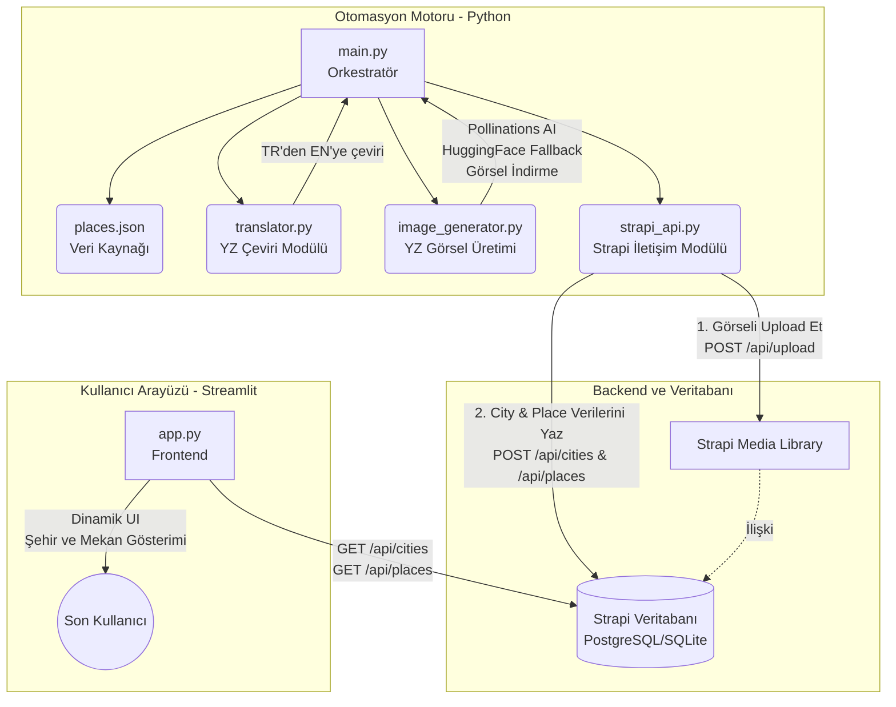

# Final Sınavı Proje Raporu: YZ Destekli Gezi Rehberi

## Sistem Mimarisi Şeması

## Teknik Detaylar (Python Kod Açıklamaları)

Sistemimiz tek bir script üzerinden değil, modüler ve profesyonel bir yapıda 4 farklı dosyaya bölünmüştür:

1. **`main.py` (Orkestratör):** Tüm süreci yöneten ana dosyadır. `places.json` dosyasını okur, içindeki şehirleri döngüye alır. Önce çeviri modülüne kelimeleri gönderir, ardından resim üretim modülüne bağlanır. Tüm bu verileri toparlayıp `strapi_api.py` aracılığıyla Strapi'ye kaydeder.
2. **`translator.py` (Çeviri Modülü):** Python'un `deep-translator` kütüphanesini kullanarak Türkçe metinleri (şehir bilgisi, mekan açıklamaları) otomatik olarak İngilizceye çevirir.
3. **`image_generator.py` (Görsel Üretim Modülü):** Gönderilen mekan ve şehir ismine uygun yapay zeka istemini (prompt) hazırlar ve öncelikle **Pollinations AI** API'sine göndererek özgün bir görsel üretir. Pollinations AI başarısız olursa ikincil olarak **HuggingFace Stable Diffusion XL** modeline başvurur. Üretilen görseli bilgisayara geçici olarak kaydeder.
4. **`strapi_api.py` (API Entegrasyon Modülü):** Strapi'nin REST API'si ile `Bearer Token` kullanarak güvenli bir şekilde haberleşir. Önce `image_generator.py`'nin oluşturduğu görseli `POST /api/upload` uç noktasıyla Strapi Media Library'ye yükler. Ardından görselin ID'sini alarak Mekan (Place) kaydını oluşturur ve kapak resmi (Cover Image) olarak bağlar.

## Görsel Üretim Süreci

Sistemde görseller aşağıdaki öncelik zinciriyle üretilir:

1. **Pollinations AI (Birincil):** Güncel unified API (`https://gen.pollinations.ai/image/...`) üzerinden `POLLINATIONS_API_KEY` ile görsel üretilir.
2. **HuggingFace Stable Diffusion XL (İkincil):** `.env` dosyasında `HUGGINGFACE_API_KEY` tanımlıysa, Pollinations başarısız olduğunda HuggingFace üzerinden görsel üretilir.
3. **picsum.photos (Son Çare):** Tüm YZ servisleri başarısız olursa, mekan adına göre seed ile stok fotoğraf indirilir.

## Media Library Yükleme Süreci

Üretilen görseller **sadece URL olarak tutulmaz**, Strapi Media Library'ye fiziksel olarak yüklenir:

1. Görsel `automation/images/` klasörüne kaydedilir.
2. `strapi_api.py` içindeki `upload_image()` fonksiyonu, görseli `POST /api/upload` endpoint'ine `multipart/form-data` formatında yükler.
3. Strapi'den dönen **Media ID** alınır.
4. Bu Media ID, mekan (Place) kaydının `cover_image` ilişkisine bağlanır.

*(Not: Kodların tam metnini bilgisayarınızdaki dosyalardan kopyalayıp raporunuza ekleyebilirsiniz.)*
