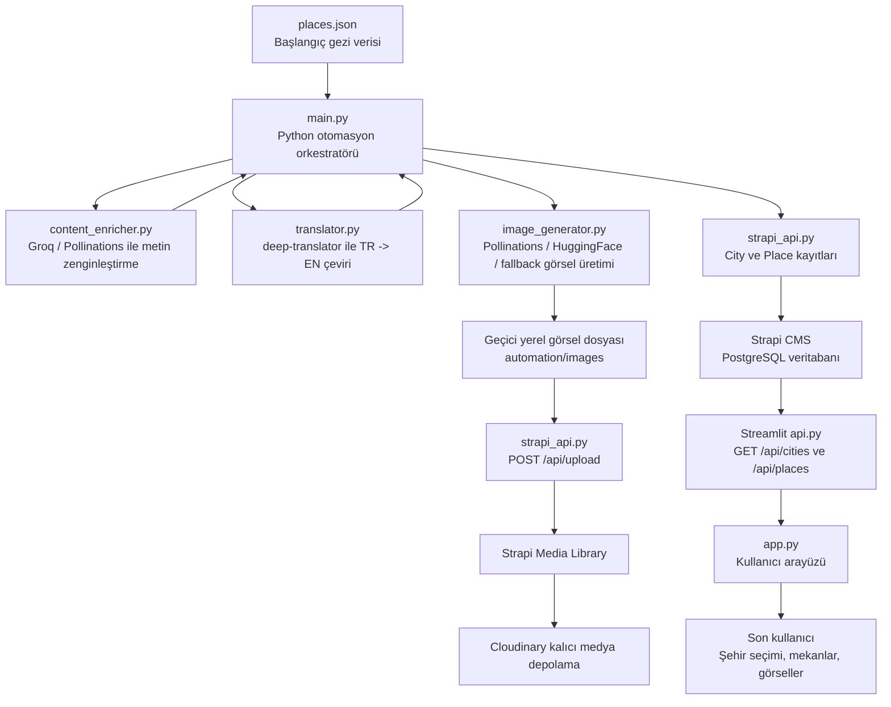

# Final Sınavı Proje Raporu

## Kapak Sayfası

**Proje Adı:** Dünyayi Gezayisun AI Rehberuylan  
**Proje Türü:** YZ Destekli Çok Dilli Gezi Rehberi  
**Ders / Sınav:** Final Projesi  
**Öğrenci Adı Soyadı:** [Ad Soyad]  
**Öğrenci Numarası:** [Numara]  
**Teslim Tarihi:** [Teslim Tarihi]  

---

## 1. Proje Özeti

Bu proje, dünyanın farklı şehirleri için gezi rehberi içerikleri toplayan, içerikleri yapay zeka ve çeviri araçlarıyla zenginleştiren, Strapi üzerinde çok dilli ve ilişkisel bir veritabanında saklayan, ardından Streamlit tabanlı modern bir arayüzle kullanıcıya sunan uçtan uca bir sistemdir.

Sistemde şehirler ve şehirlerde gezilecek mekanlar Strapi CMS üzerinde tutulur. Python otomasyon scripti çalıştırıldığında veri kaynağından şehir ve mekan bilgilerini okur, açıklamaları yapay zeka ile zenginleştirir, `deep-translator` ile İngilizceye çevirir, mekanlara uygun turistik görselleri hazırlar ve bu görselleri Strapi Media Library'ye yükleyerek mekan kayıtlarına bağlar. Streamlit arayüzü ise Strapi API'den bu verileri çekerek kullanıcıya şehir seçimi, mekan kartları, puanlar, iki dilli açıklamalar ve YZ görselleriyle birlikte gösterir.

Canlı sistemde doğrulanan veri durumu:

| Veri Türü | Adet |
|---|---:|
| Şehir | 3 |
| Mekan | 9 |
| Strapi Media Library / Cloudinary görseli | 9 |

---

## 2. Erişim Bilgileri

### 2.1 Strapi Yönetim Paneli

**Strapi Admin URL:**  
https://ai-travel-guide-strapi.onrender.com/admin

**Kullanıcı adı / e-posta:** [Strapi admin e-posta adresi]  
**Şifre:** [Strapi admin şifresi]

> Not: Kullanıcı adı ve şifre güvenlik nedeniyle GitHub'a veya açık rapor metnine yazılmamalıdır. Teslim sistemi güvenli değilse bu bilgiler öğretmene ayrıca iletilmelidir.

### 2.2 Streamlit Frontend

**Streamlit URL:**  
https://ai-travel-guide-frontend.onrender.com

### 2.3 Backend API

**Strapi API ana adresi:**  
https://ai-travel-guide-strapi.onrender.com

Örnek endpointler:

```text
GET /api/cities
GET /api/places?populate=*
POST /api/upload
POST /api/cities
POST /api/places
```

---

## 3. Sistem Mimarisi Şeması



### 3.1 Veri Akışı

1. `automation/data/places.json` dosyasından şehir ve mekan verileri okunur.
2. `content_enricher.py` ile açıklamalar gezi rehberi üslubunda zenginleştirilir.
3. `translator.py` ile Türkçe açıklamalar İngilizceye çevrilir.
4. `image_generator.py` ile mekan adına uygun turistik/manzara görseli hazırlanır.
5. `strapi_api.py`, görselleri önce Strapi Media Library'ye yükler.
6. Media ID, mekanın `cover_image` alanına bağlanır.
7. Şehir ve mekan kayıtları Strapi API'ye Bearer Token ile güvenli şekilde yazılır.
8. Streamlit uygulaması Strapi'den şehirleri ve mekanları çekip kullanıcıya gösterir.

---

## 4. Backend ve Veri Modelleme

Backend katmanında Strapi CMS kullanılmıştır. Render canlı ortamında Strapi, PostgreSQL veritabanı ile çalışır. Görseller Render dosya sisteminde tutulmadığı için Cloudinary medya sağlayıcısı olarak yapılandırılmıştır.

### 4.1 Cities Koleksiyonu

| Alan | Tip | Açıklama |
|---|---|---|
| `name` | Short text | Şehir adı |
| `name_en` | Short text | Şehir adının İngilizce karşılığı |
| `country` | Short text | Ülke adı |
| `country_en` | Short text | Ülke adının İngilizce karşılığı |
| `short_info` | Long text | Türkçe kısa şehir bilgisi |
| `short_info_en` | Long text | İngilizce kısa şehir bilgisi |
| `places` | Relation | Bir şehrin birden fazla mekanı vardır |

### 4.2 Places Koleksiyonu

| Alan | Tip | Açıklama |
|---|---|---|
| `name` | Short text | Mekan adı |
| `name_en` | Short text | Mekanın İngilizce adı |
| `description_tr` | Long text | Türkçe mekan açıklaması |
| `description_en` | Long text | İngilizce mekan açıklaması |
| `rating` | Decimal | Mekan puanı |
| `cover_image` | Media, single image | Mekanın Strapi Media Library'deki kapak görseli |
| `city` | Relation | Mekanın bağlı olduğu şehir |

### 4.3 İlişkisel Tasarım

Projede ilişki şu şekilde kurulmuştur:

```text
City 1 ---- N Place
```

Yani bir şehirde birden çok mekan bulunabilir, ancak her mekan tek bir şehre bağlıdır. Strapi şeması tarafında bu ilişki:

```text
City.places -> oneToMany
Place.city -> manyToOne
```

olarak tanımlanmıştır.

### 4.4 Çok Dillilik

Strapi i18n desteği aktif edilmiştir. Varsayılan dil Türkçedir (`tr`). İkinci dil olarak İngilizce içerikler desteklenir. Uygulamada hem Strapi i18n yapısı hem de pratik kullanım için `*_en` alanları kullanılmıştır. Streamlit arayüzünde kullanıcı TR / EN seçimi yapabilir.

---

## 5. API ve Güvenlik

Python otomasyon scripti Strapi'ye veri yazarken API Token kullanır. Token, HTTP isteklerinde `Authorization` başlığıyla gönderilir:

```text
Authorization: Bearer STRAPI_API_TOKEN
```

Bu token `.env` dosyasında tutulur ve `.gitignore` nedeniyle GitHub'a yüklenmez. Render canlı ortamında da tokenlar Environment Variables alanında saklanır.

Kullanılan güvenlik yaklaşımı:

- Gerçek tokenlar kaynak koda yazılmaz.
- `.env` dosyaları Git takibine alınmaz.
- Streamlit canlı ortamında Strapi okuma işlemleri için `STRAPI_API_TOKEN` environment variable olarak verilir.
- Strapi yazma işlemleri sadece token yetkisi olan otomasyon scriptiyle yapılır.

---

## 6. Yapay Zeka ve Çeviri Entegrasyonu

### 6.1 Metin Zenginleştirme

`content_enricher.py` dosyası, şehir ve mekan açıklamalarını daha açıklayıcı bir gezi rehberi metnine dönüştürür. Birincil metin üretim servisi Groq API'dir. Groq çalışmazsa Pollinations text API yedek olarak denenir. Yedek servisler de çalışmazsa sistem temel açıklamayla devam eder.

### 6.2 Çeviri

`translator.py`, `deep-translator` kütüphanesi içindeki `GoogleTranslator` sınıfını kullanır. Türkçe açıklamalar İngilizceye çevrilir. Çeviri başarısız olursa sistem akışı bozulmasın diye orijinal metin döndürülür.

### 6.3 Görsel Üretimi

`image_generator.py`, mekan ve şehir adına göre İngilizce bir görsel prompt'u üretir. Görsel üretim sırası şu şekildedir:

1. Pollinations AI
2. HuggingFace Stable Diffusion XL
3. `picsum.photos` fallback

Oluşturulan veya daha önce oluşturulmuş olan görsel önce `automation/images/` klasörüne kaydedilir. Sonrasında Strapi Media Library'ye yüklenir.

---

## 7. Dosya Yönetimi ve Media Library

Görseller sadece yerel bilgisayarda bırakılmamıştır. Otomasyon akışında:

1. Görsel yerelde geçici olarak hazırlanır.
2. `POST /api/upload` endpoint'i ile Strapi Media Library'ye gönderilir.
3. Render canlı ortamında Strapi upload provider olarak Cloudinary kullanır.
4. Cloudinary URL'si Strapi medya kaydında tutulur.
5. Media ID, `Place.cover_image` alanına bağlanır.

Canlı kontrol sonucunda 9 mekanın tamamında `cover_image` doludur.

Örnek canlı Cloudinary görsel URL'leri:

```text
https://res.cloudinary.com/dhuumqcno/image/upload/.../ystanbul_ayasofya_camii_....jpg
https://res.cloudinary.com/dhuumqcno/image/upload/.../paris_eiffel_tower_....jpg
https://res.cloudinary.com/dhuumqcno/image/upload/.../londra_tower_bridge_....jpg
```

---

## 8. Frontend Sunumu

Frontend Streamlit ile geliştirilmiştir. Uygulama Strapi API üzerinden şehirleri ve mekanları çeker. Kullanıcı arayüzünde:

- Dil seçimi yapılabilir: TR / EN
- Kullanıcı şehir seçebilir.
- Seçilen şehrin adı, ülkesi ve kısa açıklaması gösterilir.
- Seçilen şehre bağlı mekanlar kart yapısıyla listelenir.
- Her mekan için kapak görseli, puan, Türkçe/İngilizce açıklama ve devamını oku alanı gösterilir.

Site adı:

```text
Dünyayi Gezayisun AI Rehberuylan
```

---

## 9. Canlı Sistem Doğrulaması

Canlı sistemde yapılan API kontrolünde aşağıdaki sonuçlar alınmıştır:

```text
cities_count=3

İstanbul: places=3, images=3
Paris: places=3, images=3
Londra: places=3, images=3

all_places=9
all_images=9
```

Streamlit istemcisiyle yapılan doğrulama:

```text
cities 3
İstanbul 3 3
Paris 3 3
Londra 3 3
total 9 images 9
```

Bu sonuçlar, Strapi veritabanında şehir ve mekan kayıtlarının bulunduğunu, her mekanın doğru şehirle ilişkilendirildiğini ve her mekanın kapak görselinin yüklendiğini göstermektedir.

---

## 10. Ekran Görüntüleri

Bu bölümde teslimden önce alınacak ekran görüntüleri yer almalıdır.

### 10.1 Strapi Content-Type Builder - City

Eklenmesi gereken ekran görüntüsü:

```text
Strapi Admin > Content-Type Builder > City
Alanlar: name, name_en, country, country_en, short_info, short_info_en, places
```

### 10.2 Strapi Content-Type Builder - Place

Eklenmesi gereken ekran görüntüsü:

```text
Strapi Admin > Content-Type Builder > Place
Alanlar: name, name_en, description_tr, description_en, rating, cover_image, city
```

### 10.3 Strapi Content Manager - Veri Dolmadan Önce

Eklenmesi gereken ekran görüntüsü:

```text
Python scripti çalışmadan önce Cities / Places listesinin boş hali.
```

Eğer boş halin ekran görüntüsü alınmadıysa rapora şu not düşülebilir:

```text
İlk kurulumda Strapi veritabanı boştu. Python otomasyonu çalıştırıldıktan sonra Cities ve Places koleksiyonları otomatik doldurulmuştur.
```

### 10.4 Strapi Content Manager - Veri Dolduktan Sonra

Eklenmesi gereken ekran görüntüsü:

```text
Cities listesinde İstanbul, Paris, Londra kayıtları.
Places listesinde 9 mekan kaydı.
```

### 10.5 Strapi Media Library

Eklenmesi gereken ekran görüntüsü:

```text
Media Library içinde 9 adet yüklenmiş mekan görseli.
```

### 10.6 Streamlit Frontend

Eklenmesi gereken ekran görüntüsü:

```text
Canlı Streamlit sitesinde şehir seçimi, mekan kartları ve görsellerin göründüğü sayfa.
```

---

## 11. Python Kodlarının Açıklaması

### 11.1 `main.py`

Ana otomasyon dosyasıdır. `places.json` dosyasını okur, her şehir için şehir kaydını oluşturur veya günceller, her mekan için açıklama zenginleştirme, çeviri, görsel üretimi, görsel upload ve Strapi kayıt oluşturma/güncelleme adımlarını yönetir.

Ana fonksiyon:

```text
main()
```

Görevleri:

- `.env` dosyasından `STRAPI_URL` ve `STRAPI_API_TOKEN` değerlerini okur.
- `places.json` veri kaynağını yükler.
- Şehir açıklamasını yapay zeka ile zenginleştirir.
- Şehir bilgilerini İngilizceye çevirir.
- Strapi üzerinde şehir kaydını oluşturur veya günceller.
- Mekan açıklamasını yapay zeka ile zenginleştirir.
- Mekan açıklamasını İngilizceye çevirir.
- Mekan görselini üretir veya var olan görseli kullanır.
- Görseli Strapi Media Library'ye yükler.
- Mekan kaydını Strapi'de şehir ilişkisi ve kapak görseli ile birlikte oluşturur/günceller.

### 11.2 `translator.py`

Çeviri modülüdür. `deep-translator` kütüphanesi ile Türkçe metinleri İngilizceye çevirir.

Ana fonksiyon:

```text
translate_text(text, source="tr", target="en")
```

Görevleri:

- Boş metin gelirse boş string döndürür.
- GoogleTranslator ile çeviri yapar.
- Hata olursa sistemin durmaması için orijinal metni geri döndürür.

### 11.3 `content_enricher.py`

YZ metin üretim modülüdür. Şehir ve mekan açıklamalarını gezi rehberi üslubunda zenginleştirir.

Ana fonksiyonlar:

```text
enrich_city_info(city_name, country, base_info)
enrich_place_description(place_name, city_name, country, base_description)
```

Görevleri:

- Groq API ile daha bilgilendirici Türkçe açıklamalar üretir.
- Groq başarısız olursa Pollinations text API yedeğini dener.
- Tüm yapay zeka servisleri başarısız olursa temel metni kullanarak akışı sürdürür.

### 11.4 `image_generator.py`

Görsel üretim modülüdür. Mekan ve şehir adına uygun turistik/manzara görseli üretir.

Ana fonksiyon:

```text
generate_and_save_image(place_name, city_name, output_dir="images")
```

Yardımcı fonksiyonlar:

```text
slugify(text)
_build_prompt(place_name, city_name)
_generate_with_pollinations(prompt, filepath)
_generate_with_huggingface(prompt, filepath, hf_token)
_generate_with_picsum(place_name, filepath)
```

Görevleri:

- Dosya adı için güvenli slug üretir.
- Mekan ve şehir adına göre İngilizce prompt hazırlar.
- Önceden üretilmiş görsel varsa tekrar üretmeden onu kullanır.
- Pollinations AI ile görsel üretir.
- Gerekirse HuggingFace yedeğini dener.
- Son çare olarak picsum.photos üzerinden fallback görsel indirir.

### 11.5 `strapi_api.py`

Strapi REST API entegrasyon modülüdür. Token ile güvenli API haberleşmesi yapar.

Ana sınıf:

```text
StrapiAPI
```

Önemli fonksiyonlar:

```text
get_or_create_city(...)
upload_image(file_path)
create_place(...)
```

Görevleri:

- Şehir kaydı varsa bulur, yoksa oluşturur.
- Var olan şehir kayıtlarının İngilizce alanlarını günceller.
- Görsel dosyasını `POST /api/upload` ile Strapi Media Library'ye yükler.
- Mekan kaydı varsa günceller, yoksa oluşturur.
- Mekanı doğru şehir ile ilişkilendirir.
- Media ID'yi `cover_image` alanına bağlar.

---

## 12. Kod Dosyalarının Tam Metni

Python kodlarının tam metni proje klasöründe aşağıdaki dosyalarda yer almaktadır:

```text
automation/main.py
automation/translator.py
automation/content_enricher.py
automation/image_generator.py
automation/strapi_api.py
automation/data/places.json
frontend-streamlit/app.py
frontend-streamlit/api.py
```

Rapor Word/PDF formatına dönüştürülürken bu dosyaların tam metinleri "Ekler" bölümüne eklenebilir. Kodlar ayrıca GitHub deposunda da aynı dosya yollarıyla bulunmaktadır.

---

## 13. Render ve Canlıya Alma

Proje Render üzerinde iki web servisi ve bir veritabanı ile çalışmaktadır:

| Servis | Teknoloji | Açıklama |
|---|---|---|
| `ai-travel-guide-strapi` | Node.js / Strapi | Backend ve CMS |
| `ai-travel-guide-frontend` | Python / Streamlit | Kullanıcı arayüzü |
| `ai-travel-guide-db` | PostgreSQL | Strapi veritabanı |

Strapi servisinde kullanılan önemli environment variable'lar:

```text
DATABASE_CLIENT=postgres
DATABASE_URL=<Render PostgreSQL connection string>
UPLOAD_PROVIDER=cloudinary
CLOUDINARY_NAME=<Cloudinary cloud name>
CLOUDINARY_KEY=<Cloudinary API key>
CLOUDINARY_SECRET=<Cloudinary API secret>
STRAPI_PLUGIN_I18N_INIT_LOCALE_CODE=tr
```

Frontend servisinde kullanılan önemli environment variable'lar:

```text
STRAPI_URL=https://ai-travel-guide-strapi.onrender.com
STRAPI_API_TOKEN=<Strapi read token>
```

---

## 14. Sonuç

Bu proje kapsamında Strapi tabanlı ilişkisel ve çok dilli bir gezi rehberi backend'i, Python tabanlı YZ destekli veri hazırlama otomasyonu ve Streamlit tabanlı modern bir kullanıcı arayüzü geliştirilmiştir. Python otomasyonu, şehir ve mekan verilerini işler, açıklamaları zenginleştirir, İngilizce çeviri üretir, görselleri Strapi Media Library'ye yükler ve kayıtları ilişkili biçimde Strapi veritabanına kaydeder.

Canlı sistemde 3 şehir, 9 mekan ve 9 görsel başarıyla doğrulanmıştır. Bu nedenle proje; veri modelleme, API güvenliği, YZ/çeviri entegrasyonu, medya dosya yönetimi, frontend sunumu ve kod düzeni gereksinimlerini karşılamaktadır.


---

# Ekler: Python Betiğinin Tam Metni


## Ek - automation/main.py

```python
import os
import json
import logging
from dotenv import load_dotenv

# Import our helper modules
from translator import translate_text
from content_enricher import enrich_city_info, enrich_place_description
from image_generator import generate_and_save_image
from strapi_api import StrapiAPI

BASE_DIR = os.path.dirname(os.path.abspath(__file__))

# Load configuration from automation/.env regardless of the current working directory.
load_dotenv(os.path.join(BASE_DIR, ".env"))

# Setup logger
logging.basicConfig(level=logging.INFO, format="%(asctime)s - %(levelname)s - %(message)s")
logger = logging.getLogger(__name__)

def main():
    logger.info("Starting AI Travel Guide Automation Pipeline...")
    
    # Retrieve configuration parameters
    api_url = os.getenv("STRAPI_URL")
    api_token = os.getenv("STRAPI_API_TOKEN")
    
    # Provide helpful troubleshooting messages if not configured yet
    if not api_url or not api_token or api_token == "your_strapi_api_token_here":
        logger.error("Configuration Error: STRAPI_URL and STRAPI_API_TOKEN must be configured.")
        logger.error("Please configure your .env file in the automation directory before running this pipeline.")
        logger.info("Read README.md for step-by-step instructions on creating a Strapi token.")
        return

    # Initialize Strapi client
    strapi = StrapiAPI(api_url, api_token)
    
    # Path to input JSON
    data_path = os.path.join(BASE_DIR, "data", "places.json")
    if not os.path.exists(data_path):
        logger.error(f"Data file not found at path: {data_path}")
        return
        
    try:
        with open(data_path, "r", encoding="utf-8") as f:
            cities_data = json.load(f)
    except Exception as e:
        logger.error(f"Failed to read places.json data file: {e}")
        return
        
    logger.info(f"Successfully loaded {len(cities_data)} cities from data source.")
    
    # Process each city
    for item in cities_data:
        city_info = item.get("city", {})
        places_list = item.get("places", [])
        
        city_name = city_info.get("name")
        country = city_info.get("country")
        short_info = city_info.get("short_info")
        
        if not city_name:
            logger.warning("Skipping entry with empty city name.")
            continue
            
        logger.info("\n" + "="*50 + f"\nProcessing City: {city_name} ({country})\n" + "="*50)
        
        # Enrich city intro with AI, then translate it to English
        enriched_short_info = enrich_city_info(city_name, country, short_info)
        city_name_en = translate_text(city_name, source="tr", target="en") or city_name
        country_en = translate_text(country, source="tr", target="en") or country
        short_info_en = translate_text(enriched_short_info, source="tr", target="en") or enriched_short_info
        
        # 1. Resolve City ID (Get or Create)
        city_ref = strapi.get_or_create_city(
            name=city_name,
            name_en=city_name_en,
            country=country,
            country_en=country_en,
            short_info=enriched_short_info,
            short_info_en=short_info_en
        )
        if not city_ref:
            logger.error(f"Could not resolve City ID for '{city_name}'. Skipping all associated places...")
            continue
            
        # Process all places in the city
        for place in places_list:
            place_name = place.get("name")
            desc_tr = place.get("description_tr")
            rating = place.get("rating", 5.0)
            
            if not place_name or not desc_tr:
                logger.warning(f"Place '{place_name}' has missing information. Skipping...")
                continue
                
            logger.info(f"\n--- Processing Place: {place_name} ---")
            
            # Determine appropriate names for Turkish and English contexts
            is_turkish_context = (country.lower() == "türkiye" or country.lower() == "turkey")
            if is_turkish_context:
                name_tr = place_name
                name_en = translate_text(place_name, source="tr", target="en") or place_name
            else:
                name_en = place_name
                name_tr = translate_text(place_name, source="en", target="tr") or place_name
            
            # 2. Enrich Turkish description with AI, then translate it to English
            enriched_desc_tr = enrich_place_description(place_name, city_name, country, desc_tr)
            desc_en = translate_text(enriched_desc_tr, source="tr", target="en")
            if not desc_en:
                logger.warning(f"Translation returned empty. Falling back to Turkish description.")
                desc_en = enriched_desc_tr
                
            # 3. Generate image using Pollinations AI (with HuggingFace/picsum fallback)
            local_image_path = generate_and_save_image(place_name, city_name, output_dir=os.path.join(BASE_DIR, "images"))
            
            # 4. Upload image to Strapi Media Library
            image_id = None
            if local_image_path:
                image_id = strapi.upload_image(local_image_path)
                if not image_id:
                    logger.warning(f"Image upload failed for '{place_name}'. Placing without cover image...")
            else:
                logger.warning(f"Image generation failed for '{place_name}'. Placing without cover image...")
                
            # 5. Create Place record in Strapi
            success = strapi.create_place(
                name=name_tr,
                name_en=name_en,
                description_tr=enriched_desc_tr,
                description_en=desc_en,
                rating=rating,
                city_ref=city_ref,
                image_id=image_id
            )
            
            if success:
                logger.info(f"Finished processing place '{place_name}' successfully.")
            else:
                logger.error(f"Failed to add place '{place_name}' to database.")
                
    logger.info("\n" + "="*50 + "\nAutomation Pipeline Completed!\n" + "="*50)

if __name__ == "__main__":
    main()
```


## Ek - automation/translator.py

```python
import logging
from deep_translator import GoogleTranslator

# Setup logger
logging.basicConfig(level=logging.INFO, format="%(asctime)s - %(levelname)s - %(message)s")
logger = logging.getLogger(__name__)

def translate_text(text: str, source: str = "tr", target: str = "en") -> str:
    """
    Translates text from source language to target language.
    
    Args:
        text (str): The text to translate.
        source (str): Source language code (default 'tr').
        target (str): Target language code (default 'en').
        
    Returns:
        str: The translated text, or the original text if translation fails.
    """
    if not text:
        return ""
        
    try:
        logger.info(f"Translating text: '{text[:30]}...' from '{source}' to '{target}'")
        translated = GoogleTranslator(source=source, target=target).translate(text)
        logger.info("Translation completed successfully.")
        return translated
    except Exception as e:
        logger.error(f"Error during translation: {e}")
        # Return original text as a fallback
        return text

if __name__ == "__main__":
    # Quick self-test
    test_tr = "Galata Kulesi, İstanbul'un en eski ve en güzel yapılarından biridir."
    test_en = translate_text(test_tr)
    print(f"Original (TR): {test_tr}")
    print(f"Translated (EN): {test_en}")
```


## Ek - automation/content_enricher.py

```python
import logging
import os
import re
import urllib.parse

import requests
from dotenv import load_dotenv

load_dotenv()

logging.basicConfig(level=logging.INFO, format="%(asctime)s - %(levelname)s - %(message)s")
logger = logging.getLogger(__name__)


GROQ_API_URL = "https://api.groq.com/openai/v1/chat/completions"
POLLINATIONS_TEXT_API_URL = "https://gen.pollinations.ai/text"
POLLINATIONS_LEGACY_TEXT_API_URL = "https://text.pollinations.ai"


def _system_prompt() -> str:
    return (
        "Sen Turkce yazan profesyonel bir gezi rehberi editorusun. "
        "Cevaplarini tek paragraf halinde, akici ve bilgilendirici yaz. "
        "Markdown, baslik, secenek, madde isareti, fiyat, calisma saati veya kesin olmayan guncel bilgi kullanma. "
        "Temel aciklamada yer almiyorsa kesin yil, tarih veya tartismali ayrinti ekleme. "
        "Sadece istenen tanitim paragrafini dondur."
    )


def _clean_generated_text(text: str) -> str:
    """Normalize AI output into a single clean Turkish paragraph."""
    if not text:
        return ""

    text = text.strip()
    text = re.sub(r"^```(?:\w+)?|```$", "", text).strip()
    text = re.sub(r"^\s*[-*]\s+", "", text, flags=re.MULTILINE)
    text = re.sub(r"^(İşte|Iste|Elbette|Tabii)[^:]{0,120}:\s*", "", text, flags=re.IGNORECASE)
    text = re.sub(r"^(Seçenek|Secenek)\s*\d+\s*:\s*", "", text, flags=re.IGNORECASE)
    text = re.sub(r"\s+", " ", text)
    return text.strip(" \"'")


def _call_groq_text(prompt: str, *, max_tokens: int = 360) -> str:
    """
    Generate travel-guide text with Groq's OpenAI-compatible Chat Completions API.
    """
    api_key = os.getenv("GROQ_API_KEY", "").strip()
    model = os.getenv("GROQ_TEXT_MODEL", "llama-3.3-70b-versatile").strip() or "llama-3.3-70b-versatile"

    if not api_key:
        logger.warning("GROQ_API_KEY is not set. Groq text enrichment skipped.")
        return ""

    headers = {
        "Authorization": f"Bearer {api_key}",
        "Content-Type": "application/json",
    }
    payload = {
        "model": model,
        "messages": [
            {"role": "system", "content": _system_prompt()},
            {"role": "user", "content": prompt},
        ],
        "temperature": 0.65,
        "max_tokens": max_tokens,
        "top_p": 0.9,
    }

    try:
        logger.info(f"Generating text with Groq model: {model}")
        response = requests.post(GROQ_API_URL, headers=headers, json=payload, timeout=90)
        response.raise_for_status()
        data = response.json()
        content = data.get("choices", [{}])[0].get("message", {}).get("content", "")
        return _clean_generated_text(content)
    except Exception as exc:
        logger.warning(f"Groq text enrichment failed: {exc}")
        if hasattr(exc, "response") and exc.response is not None:
            logger.warning(f"Response details: {exc.response.text[:300]}")
        return ""


def _call_pollinations_text(prompt: str, *, max_tokens: int = 360) -> str:
    """
    Fallback text generation with Pollinations.
    """
    api_key = os.getenv("POLLINATIONS_API_KEY", "").strip()
    model = os.getenv("POLLINATIONS_TEXT_MODEL", "nova-fast").strip() or "nova-fast"

    if not api_key:
        logger.warning("POLLINATIONS_API_KEY is not set. Pollinations text fallback skipped.")
        return ""

    encoded_prompt = urllib.parse.quote(prompt, safe="")
    url = f"{POLLINATIONS_TEXT_API_URL}/{encoded_prompt}"
    headers = {"Authorization": f"Bearer {api_key}"}
    params = {
        "model": model,
        "temperature": 0.7,
        "system": _system_prompt(),
        "private": "true",
        "max_tokens": max_tokens,
    }

    try:
        logger.info(f"Generating fallback text with Pollinations model: {model}")
        response = requests.get(url, headers=headers, params=params, timeout=90)
        if response.status_code == 402:
            logger.warning("Pollinations balance is insufficient. Retrying with legacy public text endpoint.")
            legacy_url = f"{POLLINATIONS_LEGACY_TEXT_API_URL}/{encoded_prompt}"
            legacy_params = {
                "model": "mistral",
                "temperature": 0.7,
                "system": _system_prompt(),
            }
            response = requests.get(legacy_url, params=legacy_params, timeout=90)
        response.raise_for_status()
        return _clean_generated_text(response.text)
    except Exception as exc:
        logger.warning(f"Pollinations text enrichment failed: {exc}")
        if hasattr(exc, "response") and exc.response is not None:
            logger.warning(f"Response details: {exc.response.text[:300]}")
        return ""


def _generate_text(prompt: str, *, max_tokens: int) -> str:
    """
    Text generation strategy:
      1. Groq API (primary)
      2. Pollinations text API (fallback)
      3. Original source text (handled by caller)
    """
    return _call_groq_text(prompt, max_tokens=max_tokens) or _call_pollinations_text(prompt, max_tokens=max_tokens)


def enrich_city_info(city_name: str, country: str, base_info: str) -> str:
    """
    Enriches a city intro using Groq text generation.

    Falls back to the original text if generation fails.
    """
    prompt = (
        f"Sehir: {city_name}\n"
        f"Ulke: {country}\n"
        f"Temel bilgi: {base_info}\n\n"
        "Bu sehir icin 55-85 kelimelik, turistlere yonelik, dogal ve bilgilendirici "
        "bir Turkce tanitim paragrafi yaz. Sehrin kulturel atmosferini, gezilecek "
        "yer cesitliligini ve ziyaret deneyimini vurgula."
    )
    enriched = _generate_text(prompt, max_tokens=280)
    return enriched or base_info


def enrich_place_description(place_name: str, city_name: str, country: str, base_description: str) -> str:
    """
    Enriches a place description using Groq text generation.

    Falls back to the original text if generation fails.
    """
    prompt = (
        f"Mekan: {place_name}\n"
        f"Sehir: {city_name}\n"
        f"Ulke: {country}\n"
        f"Temel aciklama: {base_description}\n\n"
        "Bu mekan icin 80-120 kelimelik, turistik gezi rehberi uslubunda, "
        "bilgilendirici ve akici bir Turkce tanitim paragrafi yaz. Tarihi/kulturel "
        "onemi, ziyaretciye sundugu deneyim ve neden gorulmeye deger oldugu anlatilsin. "
        "Tek paragraf yaz."
    )
    enriched = _generate_text(prompt, max_tokens=420)
    return enriched or base_description


if __name__ == "__main__":
    sample = enrich_place_description(
        "Galata Kulesi",
        "İstanbul",
        "Türkiye",
        "İstanbul'un siluetini süsleyen tarihi kule.",
    )
    print(sample)
```


## Ek - automation/image_generator.py

```python
import os
import re
import time
import requests
import logging
import urllib.parse
from translator import translate_text
from dotenv import load_dotenv

# Load environment variables
load_dotenv()

# Setup logger
logging.basicConfig(level=logging.INFO, format="%(asctime)s - %(levelname)s - %(message)s")
logger = logging.getLogger(__name__)


def slugify(text: str) -> str:
    """
    Converts text to a slug suitable for filenames.
    Handles Turkish special characters.
    """
    translation_table = str.maketrans("ğüşıöçĞÜŞİÖÇ", "gusyocGUSYOC")
    text = text.translate(translation_table)
    text = text.lower()
    text = re.sub(r'[^a-z0-9]+', '_', text)
    return text.strip('_')


def _build_prompt(place_name: str, city_name: str) -> str:
    """
    Builds an English AI image generation prompt from place and city names.
    Translates Turkish names to English for better prompt quality.
    
    Args:
        place_name (str): Name of the tourist place.
        city_name (str): Name of the city.
        
    Returns:
        str: English prompt string for AI image generation.
    """
    clean_place = translate_text(place_name, source="tr", target="en") or place_name
    clean_city = translate_text(city_name, source="tr", target="en") or city_name
    prompt = (
        f"Professional travel photography of {clean_place} in {clean_city}, "
        f"highly detailed, beautiful lighting, scenic view, realistic, 4k quality"
    )
    return prompt


def _generate_with_pollinations(prompt: str, filepath: str) -> bool:
    """
    Generates an image using Pollinations AI service.
    
    Pollinations AI image generation via a simple GET request.
    Current Pollinations unified API requires an API key.
    
    Args:
        prompt (str): The text prompt describing the desired image.
        filepath (str): Local file path to save the generated image.
        
    Returns:
        bool: True if image was successfully generated and saved.
    """
    pollinations_key = os.getenv("POLLINATIONS_API_KEY", "").strip()
    if not pollinations_key:
        logger.warning("POLLINATIONS_API_KEY is not set. Skipping Pollinations AI.")
        return False

    encoded_prompt = urllib.parse.quote(prompt)
    url = f"https://gen.pollinations.ai/image/{encoded_prompt}"
    params = {
        "width": 1024,
        "height": 768,
        "model": "flux",
    }
    headers = {"Authorization": f"Bearer {pollinations_key}"}
    
    try:
        logger.info(f"Generating image via Pollinations AI...")
        logger.info(f"Prompt: {prompt}")
        
        response = requests.get(url, headers=headers, params=params, timeout=90, allow_redirects=True)
        
        content_type = response.headers.get("content-type", "")
        if response.status_code == 200 and content_type.startswith("image/") and len(response.content) > 1000:
            with open(filepath, "wb") as f:
                f.write(response.content)
            logger.info(f"Pollinations AI image successfully saved to: {filepath}")
            return True
        else:
            logger.error(
                f"Pollinations AI failed. Status: {response.status_code}, "
                f"Content-Type: {content_type}, Size: {len(response.content)} bytes"
            )
            return False
    except requests.exceptions.Timeout:
        logger.error("Pollinations AI request timed out (90s).")
        return False
    except Exception as e:
        logger.error(f"Error with Pollinations AI: {e}")
        return False


def _generate_with_huggingface(prompt: str, filepath: str, hf_token: str) -> bool:
    """
    Generates an image using HuggingFace Inference API (Stable Diffusion XL).
    
    Args:
        prompt (str): The text prompt describing the desired image.
        filepath (str): Local file path to save the generated image.
        hf_token (str): HuggingFace API token.
        
    Returns:
        bool: True if image was successfully generated and saved.
    """
    api_url = "https://api-inference.huggingface.co/models/stabilityai/stable-diffusion-xl-base-1.0"
    headers = {"Authorization": f"Bearer {hf_token}"}
    payload = {"inputs": prompt}
    
    try:
        logger.info(f"Generating image via HuggingFace Stable Diffusion XL...")
        logger.info(f"Prompt: {prompt}")
        
        response = requests.post(api_url, headers=headers, json=payload, timeout=60)
        
        if response.status_code == 200 and len(response.content) > 1000:
            with open(filepath, "wb") as f:
                f.write(response.content)
            logger.info(f"HuggingFace AI image successfully saved to: {filepath}")
            return True
        else:
            logger.error(f"HuggingFace API failed. Status: {response.status_code}, Error: {response.text[:200]}")
            return False
    except Exception as e:
        logger.error(f"Error with HuggingFace: {e}")
        return False


def _generate_with_picsum(place_name: str, filepath: str) -> bool:
    """
    Downloads a fallback image from picsum.photos using place name as seed.
    
    Args:
        place_name (str): Name used as seed for consistent image selection.
        filepath (str): Local file path to save the image.
        
    Returns:
        bool: True if image was successfully downloaded and saved.
    """
    encoded_name = urllib.parse.quote(place_name)
    url = f"https://picsum.photos/seed/{encoded_name}/1024/768"
    
    try:
        logger.info(f"Downloading fallback image from picsum.photos...")
        response = requests.get(url, timeout=30)
        
        if response.status_code == 200:
            with open(filepath, "wb") as f:
                f.write(response.content)
            logger.info(f"Fallback image saved to: {filepath}")
            return True
        else:
            logger.error(f"Picsum failed. Status: {response.status_code}")
            return False
    except Exception as e:
        logger.error(f"Error with picsum: {e}")
        return False


def generate_and_save_image(place_name: str, city_name: str, output_dir: str = "images") -> str:
    """
    Generates a travel image for a specific place using AI services.
    
    Uses a cascading fallback strategy:
      1. Pollinations AI (Primary - free, no API key needed)
      2. HuggingFace Stable Diffusion XL (Secondary - requires API key)
      3. picsum.photos (Last resort - random stock photo)
    
    Args:
        place_name (str): Name of the tourist place.
        city_name (str): Name of the city it is located in.
        output_dir (str): Local directory to save the image (default 'images').
        
    Returns:
        str: Absolute path of the saved image, or None if all methods failed.
    """
    try:
        # Create output directory if it doesn't exist
        os.makedirs(output_dir, exist_ok=True)
        
        filename = f"{slugify(city_name)}_{slugify(place_name)}.jpg"
        filepath = os.path.join(output_dir, filename)

        if os.path.exists(filepath) and os.path.getsize(filepath) > 1000:
            logger.info(f"Using existing generated image: {filepath}")
            return os.path.abspath(filepath)
        
        # Build an English prompt for best AI results
        prompt = _build_prompt(place_name, city_name)
        
        # Strategy 1: Pollinations AI (Primary)
        logger.info(f"[1/3] Attempting Pollinations AI for '{place_name}'...")
        if _generate_with_pollinations(prompt, filepath):
            return os.path.abspath(filepath)
        
        # Strategy 2: HuggingFace Stable Diffusion (Secondary)
        hf_token = os.getenv("HUGGINGFACE_API_KEY")
        if hf_token:
            logger.info(f"[2/3] Attempting HuggingFace for '{place_name}'...")
            if _generate_with_huggingface(prompt, filepath, hf_token):
                return os.path.abspath(filepath)
        else:
            logger.warning("[2/3] HUGGINGFACE_API_KEY not set. Skipping HuggingFace.")
        
        # Strategy 3: Picsum (Last Resort)
        logger.warning(f"[3/3] AI generation failed. Using picsum.photos fallback for '{place_name}'...")
        clean_place = translate_text(place_name, source="tr", target="en") or place_name
        if _generate_with_picsum(clean_place, filepath):
            return os.path.abspath(filepath)
        
        logger.error(f"All image generation methods failed for '{place_name}'.")
        return None
        
    except Exception as e:
        logger.error(f"General error in generate_and_save_image: {e}")
        return None


if __name__ == "__main__":
    # Quick self-test
    print("Testing Pollinations AI image generation...")
    img_path = generate_and_save_image("Galata Kulesi", "İstanbul")
    print(f"Generated Image Path: {img_path}")
```


## Ek - automation/strapi_api.py

```python
import os
import mimetypes
import requests
import logging

# Setup logger
logging.basicConfig(level=logging.INFO, format="%(asctime)s - %(levelname)s - %(message)s")
logger = logging.getLogger(__name__)

class StrapiAPI:
    """
    Helper class to communicate with Strapi CMS REST API.
    """
    def __init__(self, api_url=None, token=None):
        self.api_url = api_url or os.getenv("STRAPI_URL", "http://localhost:1337")
        self.token = token or os.getenv("STRAPI_API_TOKEN", "")
        
        # Base headers. Do not specify Content-Type here because 
        # file uploads require multipart boundaries set by the requests package.
        self.headers = {
            "Authorization": f"Bearer {self.token}"
        }
        
        # Test the connection settings
        if not self.token:
            logger.warning("STRAPI_API_TOKEN is empty. API requests might fail if public permissions are not configured.")

    @staticmethod
    def _content_ref(entry: dict):
        """Return the safest REST identifier for Strapi v5/v4 content entries."""
        return entry.get("documentId") or entry.get("id")

    @staticmethod
    def _db_id(entry: dict):
        """Return the numeric database id when Strapi includes it in the response."""
        return entry.get("id")

    def _city_ref(self, entry: dict) -> dict:
        return {
            "id": self._db_id(entry),
            "documentId": self._content_ref(entry),
        }

    def get_or_create_city(self, name: str, name_en: str, country: str, country_en: str, short_info: str, short_info_en: str) -> dict:
        """
        Checks if a city exists by name. If it does, returns its ID. If not, creates it.
        Also updates translations for existing cities if possible.
        
        Args:
            name (str): City name (TR).
            name_en (str): City name in English.
            country (str): Country name (TR).
            country_en (str): Country name in English.
            short_info (str): Short description of the city (TR).
            short_info_en (str): Short description of the city in English.
            
        Returns:
            dict: City reference with id/documentId, or None if error.
        """
        url = f"{self.api_url}/api/cities"
        params = {
            "filters[name][$eq]": name
        }
        
        try:
            logger.info(f"Checking if city '{name}' exists in Strapi...")
            response = requests.get(url, headers=self.headers, params=params, timeout=10)
            response.raise_for_status()
            data = response.json()
            
            # If city exists, return its ID and try updating translations
            if data.get("data") and len(data["data"]) > 0:
                city_ref = self._city_ref(data["data"][0])
                city_document_id = city_ref["documentId"]
                logger.info(f"City '{name}' found. Ref: {city_document_id}. Updating translations...")
                try:
                    update_payload = {
                        "data": {
                            "name_en": name_en,
                            "country_en": country_en,
                            "short_info_en": short_info_en
                        }
                    }
                    json_headers = {**self.headers, "Content-Type": "application/json"}
                    update_response = requests.put(f"{url}/{city_document_id}", headers=json_headers, json=update_payload, timeout=10)
                    update_response.raise_for_status()
                except Exception as ue:
                    logger.warning(f"Could not update city translations (schema might not support them): {ue}")
                return city_ref
            
            # If not, create it
            logger.info(f"City '{name}' not found. Creating a new record...")
            json_headers = {**self.headers, "Content-Type": "application/json"}
            
            try:
                # Try creating with English translation fields
                payload = {
                    "data": {
                        "name": name,
                        "name_en": name_en,
                        "country": country,
                        "country_en": country_en,
                        "short_info": short_info,
                        "short_info_en": short_info_en
                    }
                }
                create_response = requests.post(url, headers=json_headers, json=payload, timeout=10)
                create_response.raise_for_status()
            except requests.exceptions.HTTPError as he:
                if he.response is not None and he.response.status_code == 400:
                    logger.warning("Strapi returned 400. Schema might be missing multilingual fields. Retrying with basic fields...")
                    payload = {
                        "data": {
                            "name": name,
                            "country": country,
                            "short_info": short_info
                        }
                    }
                    create_response = requests.post(url, headers=json_headers, json=payload, timeout=10)
                    create_response.raise_for_status()
                else:
                    raise he
            
            created_data = create_response.json()
            city_ref = self._city_ref(created_data["data"])
            logger.info(f"City '{name}' successfully created. Ref: {city_ref['documentId']}")
            return city_ref
            
        except Exception as e:
            logger.error(f"Error in get_or_create_city for '{name}': {e}")
            if hasattr(e, 'response') and e.response is not None:
                logger.error(f"Response details: {e.response.text}")
            return None

    def upload_image(self, file_path: str) -> int:
        """
        Uploads a local image to Strapi's Media Library.
        
        Args:
            file_path (str): The local path of the image file.
            
        Returns:
            int: Strapi Media ID or None if upload failed.
        """
        if not file_path or not os.path.exists(file_path):
            logger.error(f"Image path is invalid or does not exist: {file_path}")
            return None
            
        url = f"{self.api_url}/api/upload"
        
        try:
            logger.info(f"Uploading image '{os.path.basename(file_path)}' to Strapi Media Library...")
            
            with open(file_path, "rb") as image_file:
                # Detect MIME type automatically instead of hardcoding image/jpeg
                mime_type = mimetypes.guess_type(file_path)[0] or "image/jpeg"
                files = {
                    "files": (os.path.basename(file_path), image_file, mime_type)
                }
                # Do NOT pass Content-Type header; requests handles multipart boundary automatically
                response = requests.post(url, headers=self.headers, files=files, timeout=30)
                response.raise_for_status()
                
                uploaded_files = response.json()
                if isinstance(uploaded_files, list) and len(uploaded_files) > 0:
                    media_id = uploaded_files[0]["id"]
                    logger.info(f"Image uploaded successfully. Media ID: {media_id}")
                    return media_id
                else:
                    logger.error(f"Unexpected upload response format: {uploaded_files}")
                    return None
                    
        except Exception as e:
            logger.error(f"Error uploading image: {e}")
            if hasattr(e, 'response') and e.response is not None:
                logger.error(f"Response details: {e.response.text}")
            return None

    def create_place(self, name: str, name_en: str, description_tr: str, description_en: str, rating: float, city_ref, image_id: int = None) -> bool:
        """
        Creates a new Place record in Strapi.
        
        Args:
            name (str): Name of the place (TR).
            name_en (str): Name of the place in English.
            description_tr (str): Description in Turkish.
            description_en (str): Description in English.
            rating (float): Star rating of the place.
            city_ref: City relation reference returned by get_or_create_city.
            image_id (int, optional): Cover image media ID relation.
            
        Returns:
            bool: True if created successfully, False otherwise.
        """
        url = f"{self.api_url}/api/places"
        city_document_id = city_ref.get("documentId") if isinstance(city_ref, dict) else city_ref
        city_db_id = city_ref.get("id") if isinstance(city_ref, dict) else city_ref
        city_relation_value = city_document_id or city_db_id
        city_relation_fallback = city_db_id or city_document_id
        
        # Check if the place already exists in that city to avoid duplicate insertions
        place_exists = False
        place_id = None
        try:
            base_check_params = {
                "filters[$or][0][name][$eq]": name,
                "filters[$or][1][name_en][$eq]": name_en,
            }
            relation_filters = []
            if city_document_id and city_document_id != city_db_id:
                relation_filters.extend([
                    {"filters[city][documentId][$eq]": city_document_id},
                    {"filters[cities][documentId][$eq]": city_document_id},
                ])
            if city_db_id:
                relation_filters.extend([
                    {"filters[city][id][$eq]": city_db_id},
                    {"filters[cities][id][$eq]": city_db_id},
                ])
            # i18n-enabled relation filters can be strict; fall back to matching place names.
            relation_filters.append({})

            for relation_filter in relation_filters:
                check_params = dict(base_check_params)
                check_params.update(relation_filter)
                check_response = requests.get(url, headers=self.headers, params=check_params, timeout=10)
                if check_response.status_code != 200:
                    continue

                check_data = check_response.json()
                if check_data.get("data") and len(check_data["data"]) > 0:
                    place_exists = True
                    place_id = check_data["data"][0].get("documentId") or check_data["data"][0].get("id")
                    break
        except Exception as e:
            logger.warning(f"Failed to check duplicate for place '{name}': {e}")
            
        if place_exists and place_id is not None:
            try:
                logger.info(f"Place '{name}' already exists in city ref {city_relation_value} (ID: {place_id}). Updating record...")
                payload = {
                    "data": {
                        "name": name,
                        "name_en": name_en,
                        "description_tr": description_tr,
                        "description_en": description_en,
                        "rating": rating,
                        "city": {"connect": [city_relation_value]} if city_relation_value else None,
                    }
                }
                if payload["data"]["city"] is None:
                    payload["data"].pop("city")
                if image_id is not None:
                    payload["data"]["cover_image"] = image_id
                    
                json_headers = {**self.headers, "Content-Type": "application/json"}
                response = requests.put(f"{url}/{place_id}", headers=json_headers, json=payload, timeout=10)
                response.raise_for_status()
                logger.info(f"Place '{name}' successfully updated in Strapi.")
                return True
            except requests.exceptions.HTTPError as he:
                if he.response is not None and he.response.status_code == 400:
                    logger.warning("Strapi returned 400 during update. Retrying without name_en...")
                    payload = {
                        "data": {
                            "name": name,
                            "description_tr": description_tr,
                            "description_en": description_en,
                            "rating": rating,
                            "city": {"connect": [city_relation_value]} if city_relation_value else None,
                        }
                    }
                    if payload["data"]["city"] is None:
                        payload["data"].pop("city")
                    if image_id is not None:
                        payload["data"]["cover_image"] = image_id
                    json_headers = {**self.headers, "Content-Type": "application/json"}
                    response = requests.put(f"{url}/{place_id}", headers=json_headers, json=payload, timeout=10)
                    response.raise_for_status()
                    logger.info(f"Place '{name}' successfully updated without name_en.")
                    return True
                else:
                    logger.error(f"Error updating place '{name}' (ID: {place_id}): {he}")
                    return False
            except Exception as e:
                logger.error(f"Error updating place '{name}' (ID: {place_id}): {e}")
                return False
            
        # Create place payload
        payload = {
            "data": {
                "name": name,
                "name_en": name_en,
                "description_tr": description_tr,
                "description_en": description_en,
                "rating": rating,
                "city": {"connect": [city_relation_value]} if city_relation_value else None
            }
        }
        if payload["data"]["city"] is None:
            payload["data"].pop("city")
        
        if image_id:
            payload["data"]["cover_image"] = image_id
            
        json_headers = {**self.headers, "Content-Type": "application/json"}
        
        try:
            logger.info(f"Creating place '{name}' in Strapi...")
            response = requests.post(url, headers=json_headers, json=payload, timeout=10)
            response.raise_for_status()
            logger.info(f"Place '{name}' successfully created in Strapi.")
            return True
        except requests.exceptions.HTTPError as he:
            if he.response is not None and he.response.status_code == 400:
                logger.warning("Strapi returned 400 during creation. Retrying with fallback relation payload...")
                payload = {
                    "data": {
                        "name": name,
                        "name_en": name_en,
                        "description_tr": description_tr,
                        "description_en": description_en,
                        "rating": rating,
                        "city": city_relation_fallback
                    }
                }
                if image_id:
                    payload["data"]["cover_image"] = image_id
                try:
                    response = requests.post(url, headers=json_headers, json=payload, timeout=10)
                    response.raise_for_status()
                    logger.info(f"Place '{name}' successfully created with fallback relation payload.")
                    return True
                except requests.exceptions.HTTPError as second_he:
                    if second_he.response is not None and second_he.response.status_code == 400:
                        logger.warning("Fallback relation payload returned 400. Retrying without name_en...")
                        payload["data"].pop("name_en", None)
                        try:
                            response = requests.post(url, headers=json_headers, json=payload, timeout=10)
                            response.raise_for_status()
                            logger.info(f"Place '{name}' successfully created without name_en.")
                            return True
                        except Exception as final_e:
                            logger.error(f"Final fallback failed for place '{name}': {final_e}")
                            if hasattr(final_e, 'response') and final_e.response is not None:
                                logger.error(f"Response details: {final_e.response.text}")
                            return False
                    logger.error(f"Fallback relation payload failed for place '{name}': {second_he}")
                    if second_he.response is not None:
                        logger.error(f"Response details: {second_he.response.text}")
                    return False
            else:
                logger.error(f"Error creating place '{name}': {he}")
                if he.response is not None:
                    logger.error(f"Response details: {he.response.text}")
                return False
        except Exception as e:
            logger.error(f"Error creating place '{name}': {e}")
            return False

if __name__ == "__main__":
    # Standard quick check
    api = StrapiAPI()
    print("Strapi Client initialized. Base URL:", api.api_url)
```


## Ek - automation/data/places.json

```json
[
  {
    "city": {
      "name": "İstanbul",
      "country": "Türkiye",
      "short_info": "İstanbul, Asya ve Avrupa'yı birleştiren konumu, imparatorluklardan kalan mimari mirası ve canlı şehir kültürüyle dünyanın en etkileyici metropollerinden biridir. Tarihi yarımada, Boğaz kıyıları, müzeler, camiler ve hareketli sokak yaşamı şehri kısa bir gezide bile çok katmanlı bir deneyime dönüştürür."
    },
    "places": [
      {
        "name": "Ayasofya Camii",
        "description_tr": "Ayasofya Camii, İstanbul'un tarihi yarımadasında yer alan ve Bizans ile Osmanlı mirasını aynı yapı içinde hissettiren en önemli simgelerden biridir. 6. yüzyılda inşa edilen yapı, dev kubbesi, mermer sütunları, mozaikleri ve geniş iç hacmiyle mimarlık tarihinin dönüm noktalarından kabul edilir. Günümüzde ziyaretçiler hem ibadet atmosferini hem de yüzyıllar boyunca farklı medeniyetlerin bıraktığı sanat izlerini aynı anda görebilir.",
        "rating": 4.9
      },
      {
        "name": "Galata Kulesi",
        "description_tr": "Galata Kulesi, İstanbul siluetinin en tanınan parçalarından biri olup Ceneviz döneminden günümüze ulaşan güçlü bir şehir gözlem noktasıdır. Kuleye çıkıldığında Haliç, Boğaz, tarihi yarımada ve modern İstanbul aynı panoramada görülebilir. Çevresindeki dar sokaklar, kafeler, tasarım dükkanları ve müzikli atmosfer burayı yalnızca bir seyir terası değil, keyifli bir yürüyüş rotası haline getirir.",
        "rating": 4.7
      },
      {
        "name": "Topkapı Sarayı",
        "description_tr": "Topkapı Sarayı, Osmanlı padişahlarının yüzyıllar boyunca yönetim merkezi ve yaşam alanı olmuş geniş bir saray kompleksidir. Avluları, hazine bölümü, kutsal emanetler dairesi, mutfakları ve Boğaz'a bakan teraslarıyla ziyaretçiye imparatorluk düzenini adım adım anlatır. Sarayı gezerken yalnızca mimariyi değil, Osmanlı saray yaşamını, diplomasi kültürünü ve İstanbul'un stratejik önemini de yakından görmek mümkündür.",
        "rating": 4.8
      }
    ]
  },
  {
    "city": {
      "name": "Paris",
      "country": "Fransa",
      "short_info": "Paris, sanat müzeleri, tarihi bulvarları, ikonik anıtları ve güçlü gastronomi kültürüyle Avrupa'nın en çok ziyaret edilen şehirlerinden biridir. Seine Nehri çevresindeki yürüyüş rotaları, klasik mimari dokusu ve dünya çapındaki kültür kurumları şehri romantik olduğu kadar öğretici bir gezi durağına dönüştürür."
    },
    "places": [
      {
        "name": "Eiffel Tower",
        "description_tr": "Eyfel Kulesi, Paris'in ve Fransa'nın en bilinen simgesi olarak Champ de Mars üzerinde yükselen 324 metrelik demir bir mühendislik yapısıdır. Gustave Eiffel tarafından 1889 Dünya Fuarı için inşa edilen kule, ilk dönemlerinde tartışmalı bulunsa da zamanla modern Paris'in sembolüne dönüşmüştür. Seyir katlarından Seine Nehri, tarihi bulvarlar ve şehrin anıtları geniş bir açıyla izlenebilir; özellikle gün batımı ve gece ışıklandırması ziyaret için en etkileyici anlardandır.",
        "rating": 4.8
      },
      {
        "name": "Louvre Museum",
        "description_tr": "Louvre Müzesi, eski bir kraliyet sarayından dönüştürülmüş ve bugün dünyanın en büyük sanat koleksiyonlarından birine ev sahipliği yapan dev bir kültür merkezidir. Mona Lisa, Venus de Milo ve Antik Mısır eserleri gibi dünya çapında tanınan parçaların yanında binlerce tablo, heykel ve arkeolojik eser görülebilir. Müze çok geniş olduğu için ziyaret öncesi rota belirlemek, hem zaman yönetimi hem de eserleri daha iyi anlamak açısından önemlidir.",
        "rating": 4.9
      },
      {
        "name": "Arc de Triomphe",
        "description_tr": "Arc de Triomphe, Şanzelize Caddesi'nin batı ucunda yer alan ve Fransız tarihindeki askeri zaferleri anmak için inşa edilmiş görkemli bir anıt kemerdir. Üzerindeki kabartmalar, isimler ve anma alanları Fransa'nın 19. yüzyıldaki politik ve askeri hafızasını yansıtır. Terasına çıkıldığında Paris'in yıldız biçimli cadde düzeni, Şanzelize ve Eyfel Kulesi etkileyici bir perspektifle görülebilir.",
        "rating": 4.6
      }
    ]
  },
  {
    "city": {
      "name": "Londra",
      "country": "Birleşik Krallık",
      "short_info": "Londra, kraliyet yapıları, müzeleri, tiyatro kültürü, parkları ve çok kültürlü mahalleleriyle Avrupa'nın en hareketli başkentlerinden biridir. Thames Nehri boyunca uzanan tarihi simgeler, modern finans merkezi ve ücretsiz büyük müzeler şehri hem klasik hem çağdaş bir gezi deneyimi haline getirir."
    },
    "places": [
      {
        "name": "Big Ben",
        "description_tr": "Big Ben, Westminster Sarayı'nın yanında yükselen Elizabeth Tower içindeki ünlü çanın adıdır ve Londra'nın en tanınan sembollerinden biri olarak kabul edilir. Gotik mimarisi, saat yüzleri ve Parlamento binasıyla birlikte oluşturduğu siluet, İngiliz siyasi tarihinin güçlü bir görsel temsilidir. Thames kıyısından, Westminster Köprüsü'nden ve akşam saatlerinde ışıklandırma altında özellikle etkileyici fotoğraf noktaları sunar.",
        "rating": 4.7
      },
      {
        "name": "Tower Bridge",
        "description_tr": "Tower Bridge, Thames Nehri üzerinde yer alan, iki kuleli görünümü ve açılır kapanır yol mekanizmasıyla Londra'nın en karakteristik köprülerinden biridir. 19. yüzyıl sonlarında inşa edilen köprü, hem ulaşım işlevi hem de mühendislik mirası açısından önem taşır. Yaya geçitlerinden şehir manzarası izlenebilir; köprü içindeki sergi alanı ise yapının nasıl çalıştığını ve Londra liman tarihindeki rolünü anlatır.",
        "rating": 4.8
      },
      {
        "name": "Buckingham Palace",
        "description_tr": "Buckingham Sarayı, Birleşik Krallık hükümdarlarının Londra'daki resmi ikametgahı ve devlet törenlerinin en önemli merkezlerinden biridir. Sarayın dış cephesi, Victoria Anıtı ve geniş tören alanı kraliyet geleneğini yakından görmek isteyen ziyaretçiler için güçlü bir odak noktasıdır. Uygun dönemlerde izlenebilen nöbet değişimi töreni, müzik, üniforma ve koreografisiyle Londra gezisinin en klasik deneyimlerinden birini sunar.",
        "rating": 4.7
      }
    ]
  }
]
```
